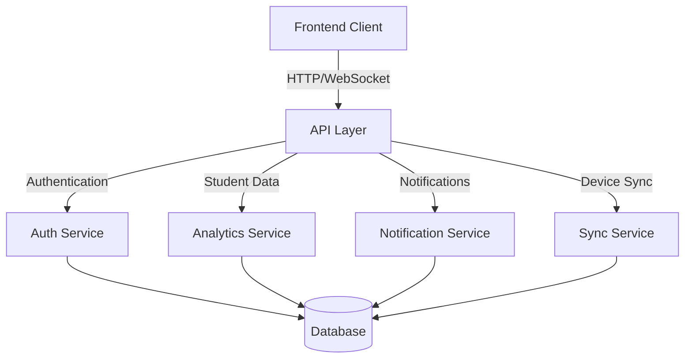
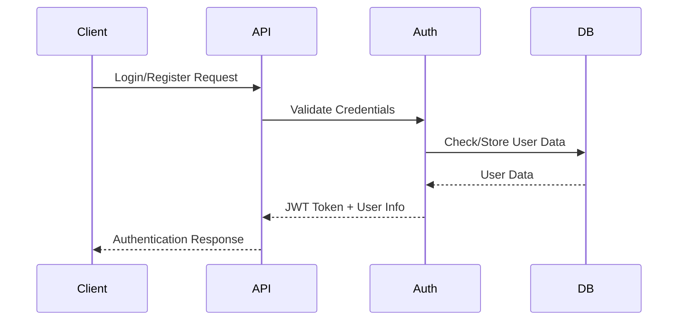
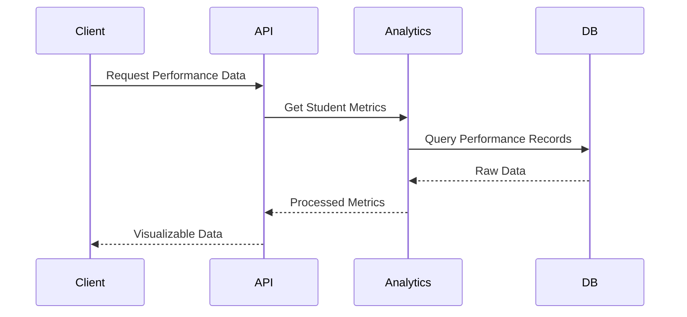
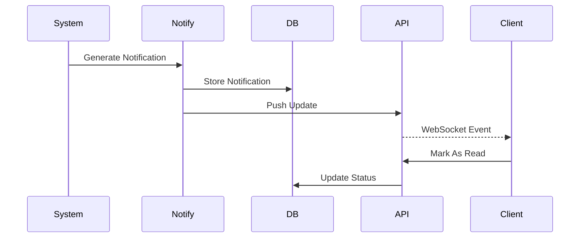
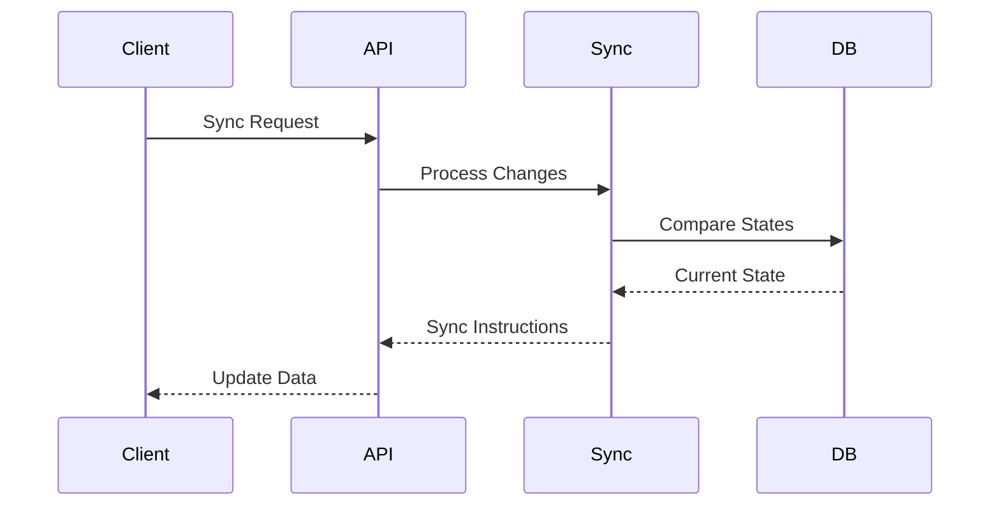
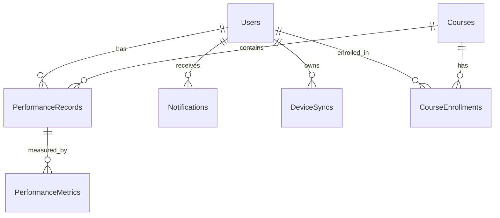

# Student Tracking System - Schema and Dataflow Information

## 1. Core Entities and Their Relationships

### Students (Central Entity)
- Primary Key: StudentID (Format: 1RV[YY][DEPT][###])
- Personal Information:
  * Name
  * Email
  * Academic History (10th, 12th marks)
  * Current Semester
  * Enrolled Courses
  * Strengths/Weaknesses (JSON format)
- Tracking Fields:
  * Profile Status
  * Last Login
  * Device Info
  * Created/Updated Timestamps

### Academic Performance
#### Exam Results
- Links to: Students (StudentID)
- Key Components:
  * Course Code
  * Test Number
  * Test Date
  * Syllabus Coverage
  * Marks (Obtained/Maximum)
  * Grading Scale
  * Verification Status
  * Feedback
- Tracking: Created/Updated Timestamps

### Course Management
#### Courses
- Primary Key: CourseCode
- Core Information:
  * Course Name
  * Credits
  * Department
  * Prerequisites (JSON)
  * Learning Outcomes
- Status:
  * Active Status
  * Created/Updated Timestamps

### Achievement System
#### Student Achievements
- Links to: Students (StudentID)
- Components:
  * Achievement Type
  * Achievement Name
  * Description
  * Date Achieved
  * Verification Status
  * Created/Updated Timestamps

### Notification System
#### Notifications
- Links to: Students (StudentID)
- Message Details:
  * Type
  * Title
  * Message Content
  * Read Status
  * Created/Read Timestamps

### Device Synchronization
#### Device Sync Logs
- Links to: Students (StudentID)
- Tracking:
  * Device ID
  * Device Type
  * Last Sync Time
  * Sync Status
  * Created Timestamp

## 2. Data Flow Patterns

### Input Flows
1. Student Registration
   - Personal Information Entry
   - Course Enrollment
   - Device Registration

2. Academic Updates
   - Exam Result Entry
   - Course Progress Updates
   - Achievement Recording

3. System Events
   - Login/Logout Events
   - Device Sync Events
   - Notification Triggers

### Output Flows
1. Student Analytics
   - Performance Reports
   - Progress Tracking
   - Achievement Summaries

2. Notifications
   - Academic Updates
   - Achievement Alerts
   - System Notifications

3. Sync Operations
   - Device Data Synchronization
   - Profile Updates
   - Course Material Access

## 3. Key Processing Points

### Authentication & Authorization
- Student Login Validation
- Profile Status Checks
- Device Authentication

### Academic Processing
- Grade Calculations
- Progress Tracking
- Performance Analytics

### Notification Processing
- Event Detection
- Notification Generation
- Delivery Status Tracking

### Synchronization
- Data Consistency Checks
- Conflict Resolution
- Update Propagation

## 4. Data Validation Rules

### Student Data
- Email Format: username@domain.tld
- StudentID Pattern: 1RV[0-9]{2}[A-Z]{2}[0-9]{3}
- Marks Range: 0-100

### Course Data
- CourseCode Pattern: [A-Z]{2}[0-9]{3}[A-Z]{2}
- Credits Range: 1-5
- Valid Prerequisites

### Achievement Data
- Valid Achievement Types
- Verification Requirements
- Date Constraints

## 5. Security Considerations

### Data Protection
- Encrypted Personal Information
- Secure Password Storage (PBKDF2-SHA256)
- Access Control Lists

### Audit Trail
- Transaction Logging
- Change History
- User Activity Tracking

### Compliance
- Data Retention Policies
- Privacy Requirements
- Academic Standards

## 6. Integration Points

### External Systems
- Email Service Integration
- Learning Management System
- Authentication Services

### API Endpoints
- Student Data Access
- Course Management
- Performance Analytics

### Backup Systems
- Regular Data Backups
- Recovery Procedures
- Archive Management

## System Architecture Overview



## Data Flow Patterns

### 1. Authentication Flow


### 2. Student Performance Tracking


### 3. Real-time Notifications


### 4. Device Synchronization


## Database Schema

### Tables Overview


### Table Definitions

#### Users
```sql
CREATE TABLE users (
    id VARCHAR(36) PRIMARY KEY,
    email VARCHAR(255) UNIQUE NOT NULL,
    student_id VARCHAR(50) UNIQUE NOT NULL,
    password_hash VARCHAR(255) NOT NULL,
    name VARCHAR(100) NOT NULL,
    role VARCHAR(20) NOT NULL,
    created_at TIMESTAMP DEFAULT CURRENT_TIMESTAMP,
    last_login TIMESTAMP,
    is_active BOOLEAN DEFAULT TRUE,
    metadata JSON,
    CONSTRAINT valid_role CHECK (role IN ('student', 'teacher', 'admin'))
);

CREATE INDEX idx_users_email ON users(email);
CREATE INDEX idx_users_student_id ON users(student_id);
```

#### Courses
```sql
CREATE TABLE courses (
    id VARCHAR(36) PRIMARY KEY,
    code VARCHAR(20) UNIQUE NOT NULL,
    name VARCHAR(100) NOT NULL,
    description TEXT,
    credits INTEGER NOT NULL,
    semester INTEGER NOT NULL,
    created_at TIMESTAMP DEFAULT CURRENT_TIMESTAMP,
    updated_at TIMESTAMP DEFAULT CURRENT_TIMESTAMP,
    is_active BOOLEAN DEFAULT TRUE,
    metadata JSON
);

CREATE INDEX idx_courses_code ON courses(code);
```

#### CourseEnrollments
```sql
CREATE TABLE course_enrollments (
    id VARCHAR(36) PRIMARY KEY,
    user_id VARCHAR(36) NOT NULL,
    course_id VARCHAR(36) NOT NULL,
    enrollment_date TIMESTAMP DEFAULT CURRENT_TIMESTAMP,
    status VARCHAR(20) NOT NULL,
    completion_date TIMESTAMP,
    metadata JSON,
    FOREIGN KEY (user_id) REFERENCES users(id),
    FOREIGN KEY (course_id) REFERENCES courses(id),
    CONSTRAINT valid_status CHECK (status IN ('enrolled', 'completed', 'dropped', 'pending'))
);

CREATE INDEX idx_enrollments_user ON course_enrollments(user_id);
CREATE INDEX idx_enrollments_course ON course_enrollments(course_id);
```

#### PerformanceRecords
```sql
CREATE TABLE performance_records (
    id VARCHAR(36) PRIMARY KEY,
    user_id VARCHAR(36) NOT NULL,
    course_id VARCHAR(36) NOT NULL,
    record_type VARCHAR(50) NOT NULL,
    value DECIMAL(10,2) NOT NULL,
    timestamp TIMESTAMP DEFAULT CURRENT_TIMESTAMP,
    metadata JSON,
    FOREIGN KEY (user_id) REFERENCES users(id),
    FOREIGN KEY (course_id) REFERENCES courses(id)
);

CREATE INDEX idx_performance_user ON performance_records(user_id);
CREATE INDEX idx_performance_course ON performance_records(course_id);
CREATE INDEX idx_performance_type ON performance_records(record_type);
```

#### PerformanceMetrics
```sql
CREATE TABLE performance_metrics (
    id VARCHAR(36) PRIMARY KEY,
    record_id VARCHAR(36) NOT NULL,
    metric_name VARCHAR(50) NOT NULL,
    metric_value DECIMAL(10,2) NOT NULL,
    timestamp TIMESTAMP DEFAULT CURRENT_TIMESTAMP,
    metadata JSON,
    FOREIGN KEY (record_id) REFERENCES performance_records(id)
);

CREATE INDEX idx_metrics_record ON performance_metrics(record_id);
CREATE INDEX idx_metrics_name ON performance_metrics(metric_name);
```

#### Notifications
```sql
CREATE TABLE notifications (
    id VARCHAR(36) PRIMARY KEY,
    user_id VARCHAR(36) NOT NULL,
    type VARCHAR(50) NOT NULL,
    title VARCHAR(255) NOT NULL,
    message TEXT NOT NULL,
    read BOOLEAN DEFAULT FALSE,
    created_at TIMESTAMP DEFAULT CURRENT_TIMESTAMP,
    read_at TIMESTAMP,
    metadata JSON,
    FOREIGN KEY (user_id) REFERENCES users(id)
);

CREATE INDEX idx_notifications_user ON notifications(user_id);
CREATE INDEX idx_notifications_read ON notifications(read);
```

#### DeviceSyncs
```sql
CREATE TABLE device_syncs (
    id VARCHAR(36) PRIMARY KEY,
    user_id VARCHAR(36) NOT NULL,
    device_id VARCHAR(255) NOT NULL,
    last_sync TIMESTAMP,
    sync_status VARCHAR(20) NOT NULL,
    data_hash VARCHAR(64),
    created_at TIMESTAMP DEFAULT CURRENT_TIMESTAMP,
    metadata JSON,
    FOREIGN KEY (user_id) REFERENCES users(id),
    CONSTRAINT valid_sync_status CHECK (sync_status IN ('pending', 'complete', 'error'))
);

CREATE INDEX idx_syncs_user ON device_syncs(user_id);
CREATE INDEX idx_syncs_device ON device_syncs(device_id);
```

### Common Queries

#### Get Student Performance Summary
```sql
SELECT 
    u.name,
    c.code as course_code,
    c.name as course_name,
    AVG(pr.value) as average_performance,
    COUNT(pr.id) as total_records
FROM users u
JOIN performance_records pr ON u.id = pr.user_id
JOIN courses c ON pr.course_id = c.id
WHERE u.id = :student_id
GROUP BY u.id, c.id
ORDER BY c.code;
```

#### Get Unread Notifications
```sql
SELECT 
    n.id,
    n.title,
    n.message,
    n.created_at
FROM notifications n
WHERE n.user_id = :user_id
    AND n.read = FALSE
ORDER BY n.created_at DESC
LIMIT :limit;
```

#### Get Course Progress
```sql
SELECT 
    c.code,
    c.name,
    ce.enrollment_date,
    COUNT(pr.id) as total_activities,
    AVG(pr.value) as average_score
FROM courses c
JOIN course_enrollments ce ON c.id = ce.course_id
LEFT JOIN performance_records pr ON c.id = pr.course_id
WHERE ce.user_id = :student_id
    AND ce.status = 'enrolled'
GROUP BY c.id, ce.enrollment_date;
```

### Indexes and Performance

1. **Primary Indexes**
   - All tables use UUID primary keys
   - Foreign keys are indexed for join performance
   - Composite indexes for common query patterns

2. **Secondary Indexes**
   - Email and student_id for quick user lookup
   - Course code for course searches
   - Read status for notification filtering
   - Timestamp fields for range queries

3. **Query Optimization**
   - Materialized views for complex analytics
   - Partitioning for large tables (notifications, performance_records)
   - Regular index maintenance
   - Query plan monitoring

## Data Models

### User Model
```typescript
interface User {
    id: string;
    email: string;
    student_id: string;
    name: string;
    role: 'student' | 'teacher' | 'admin';
    created_at: DateTime;
    last_login: DateTime;
}
```

### Performance Record
```typescript
interface PerformanceRecord {
    id: string;
    student_id: string;
    course_id: string;
    metric_type: string;
    value: number;
    timestamp: DateTime;
    metadata: JSON;
}
```

### Notification
```typescript
interface Notification {
    id: string;
    user_id: string;
    type: string;
    title: string;
    message: string;
    read: boolean;
    created_at: DateTime;
    metadata: JSON;
}
```

### Device Sync
```typescript
interface DeviceSync {
    id: string;
    user_id: string;
    device_id: string;
    last_sync: DateTime;
    sync_status: 'pending' | 'complete' | 'error';
    data_hash: string;
}
```

## API Response Formats

### Success Response
```json
{
    "success": true,
    "data": {
        // Response data
    },
    "metadata": {
        "timestamp": "2023-01-01T00:00:00Z",
        "version": "1.0"
    }
}
```

### Error Response
```json
{
    "success": false,
    "error": {
        "code": "ERROR_CODE",
        "message": "Error description",
        "details": {}
    },
    "metadata": {
        "timestamp": "2023-01-01T00:00:00Z",
        "version": "1.0"
    }
}
```

## Security Considerations

1. **Authentication**
   - JWT tokens with expiration
   - Refresh token rotation
   - Rate limiting on auth endpoints

2. **Data Access**
   - Role-based access control
   - Resource ownership validation
   - Input sanitization

3. **Device Sync**
   - Device registration required
   - Sync token validation
   - Conflict resolution strategy

## Performance Optimizations

1. **Caching Strategy**
   - Redis for frequent queries
   - Browser caching for static assets
   - Query result caching

2. **Data Loading**
   - Pagination for large datasets
   - Lazy loading for components
   - Incremental sync for devices

3. **Real-time Updates**
   - WebSocket for live notifications
   - Batch updates for sync
   - Debounced API calls
